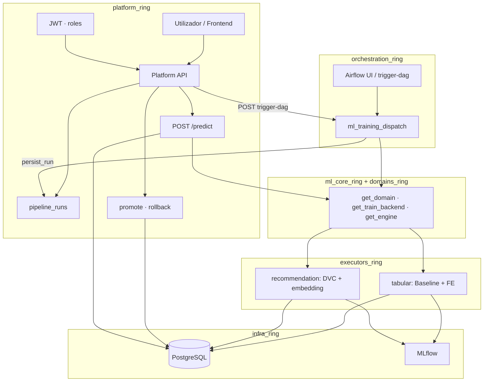

# Arquitectura por anéis (`_ring`)

Documento mestre — **Fase 0**. Define a organização modular da plataforma ML: frontend futuro, novos problemas plugáveis, **Airflow como orquestrador central de treino**.

---

## Objetivo

Uma **ferramenta ML única** com:

- Login JWT, Postgres, papéis, promote, predict (**imutável**).
- Novos problemas (**churn**, **recomendação**, futuros) **plugados** via registries — sem redesenhar o fluxo.
- Treino disparado pelo **Airflow** (tabular, DVC, workers).
- Pastas com sufixo **`_ring`** para consistência mental.

Contrato de produto: [PLATFORM_CONTRACT.md](./PLATFORM_CONTRACT.md)  
Regras de import: [IMPORT_RULES_RINGS.md](./IMPORT_RULES_RINGS.md)  
Plano de migração: [MIGRATION_RINGS.md](./MIGRATION_RINGS.md)

---

## Os cinco anéis

```text
                    ┌─────────────────────────────────────┐
   ANEL 1           │         platform_ring               │
   (produto)        │  JWT · runs · promote · predict     │
                    └─────────────────┬───────────────────┘
                                      │ trigger-dag / reads BD
                    ┌─────────────────▼───────────────────┐
   ANEL 4           │       orchestration_ring            │
   (agendamento)    │  Airflow · DVC · dispatch treino   │
                    └─────────────────┬───────────────────┘
                                      │
          ┌───────────────────────────┼───────────────────────────┐
          ▼                           ▼                           ▼
   ANEL 3                    ANEL 2 + 2b                  ANEL 0
   executors_ring            ml_core_ring                 infra_ring
   (algoritmos)              domains_ring                 (configs, BD)
```

| Anel | Pasta | Responsabilidade |
|------|-------|------------------|
| **0** | `infra_ring/` | Config, logging, database, clientes MLflow |
| **1** | `platform_ring/` | API HTTP, auth, ciclo de vida runs/deploy/predict |
| **2** | `ml_core_ring/` | Registries: DomainPlugin, TrainBackend, InferenceEngine, Manifest |
| **2b** | `domains_ring/` | Um plugin por domínio (`churn`, `recommendation`, …) |
| **3** | `executors_ring/` | Implementação pesada por `problem_type` |
| **4** | `orchestration_ring/` | Airflow DAGs, invocação DVC, tasks → backends |

**Airflow não está no `platform_ring`.** Orquestra treino; a plataforma orquestra **produto**.

---

## Fluxo end-to-end



---

## Como um novo problema entra (plug-in)

```text
1. domains_ring/fraud/plugin.py       → DomainPlugin(name="fraud", pipeline_runner_id="...")
2. executors_ring/fraud/              → FraudTrainBackend + modelos
3. ml_core_ring                       → TRAIN_BACKEND_REGISTRY["..."] = ...
4. orchestration_ring                 → task Airflow ou branch na DAG dispatch
5. platform_ring/schemas/           → FraudPredictInput (union em PredictRequest)
6. ml_core_ring/engines/            → FraudInferenceEngine (se houver /predict)
```

**Sem alterar:** login, promote, rollback, tabelas base, padrão trigger-dag.

---

## Mapeamento código actual → anéis alvo

| Localização actual | Anel alvo | Fase migração |
|--------------------|-----------|---------------|
| `src/api/` | `platform_ring/api/` | 4 |
| `src/services/processor/` | `platform_ring/` | 4 |
| `src/services/auth/`, `user/`, `roles/` | `platform_ring/` | 4 |
| `src/schemas/` | `platform_ring/schemas/` | 4 |
| `src/core/ml/` | `ml_core_ring/` | 1 |
| `src/domains/` | `domains_ring/` | 1 |
| `src/services/pipelines/` | `executors_ring/tabular_classification/` | 2 |
| `src/domains/recommendation/` (runner, models, stages) | `executors_ring/recommendation/` | 2 |
| `airflow/dags/` | `orchestration_ring/airflow/dags/` | 3 |
| `dvc.yaml` (raiz) | referenciado por `orchestration_ring` | 3 |
| `src/core/configs.py`, `database.py` | `infra_ring/` | 4+ |

Durante a transição, código legado permanece no sítio; pastas `_ring` vão sendo preenchidas.

---

## Airflow + DVC

| Ferramenta | Anel | Função |
|------------|------|--------|
| **Airflow** | `orchestration_ring` | Dispara treino, ordem, logs, UI |
| **DVC** | `orchestration_ring` + dados | Pipeline reprodutível reco; `dvc repro` numa task |
| **TrainBackend** | `ml_core_ring` | Mapeia `domain` → código a executar |

Não duplicar stages DVC em Python solto no Airflow — a task chama `dvc repro` ou o worker.

---

## Estrutura de pastas alvo

```text
src/
├── infra_ring/
├── platform_ring/
├── ml_core_ring/
├── domains_ring/
├── executors_ring/
│   ├── tabular_classification/
│   └── recommendation/
└── orchestration_ring/
    └── airflow/
        └── dags/

orchestration_ring/   # na raiz, espelho futuro (opcional)
airflow/dags/         # legado até Fase 3
```

Cada pasta `_ring` contém `README.md` com responsabilidades e imports permitidos.

---

## Estado actual (pós Fase 0)

- Documentação e pastas `_ring` criadas.
- Implementação ainda majoritariamente em `src/api`, `src/services`, `src/core/ml`, `src/domains`, `airflow/`.
- Verificador: `scripts/check_ring_imports.py`.

---

## Próximo passo

**Fase 1:** mover/consolidar `ml_core_ring`, implementar `TrainBackend` registry.

Ver [MIGRATION_RINGS.md](./MIGRATION_RINGS.md).
