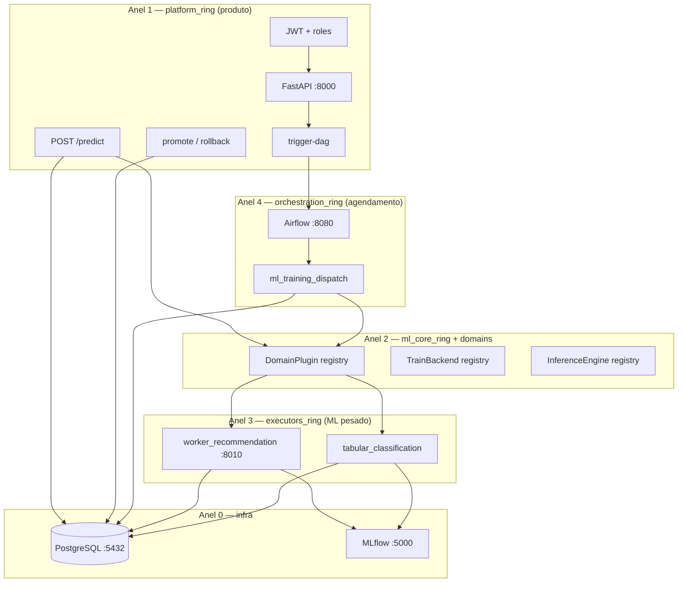
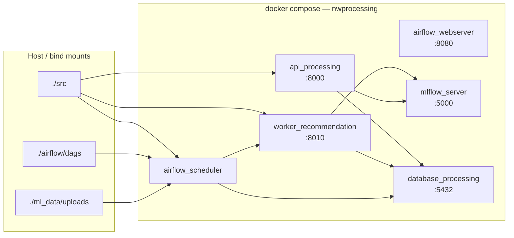
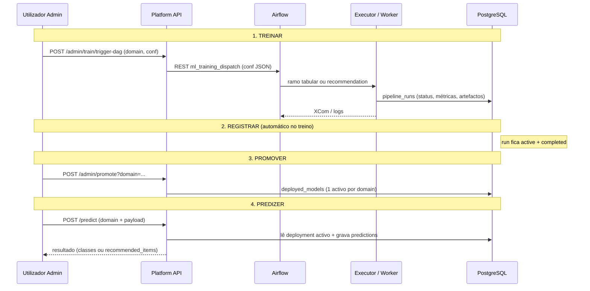
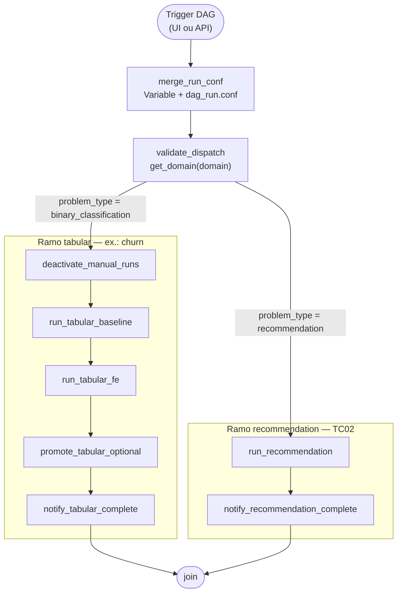
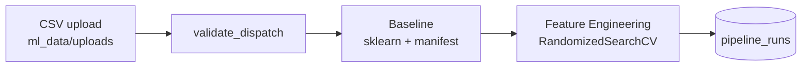
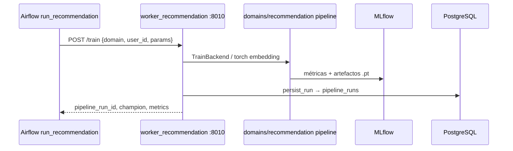
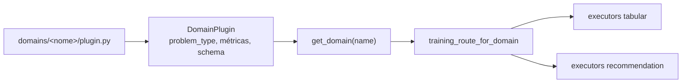
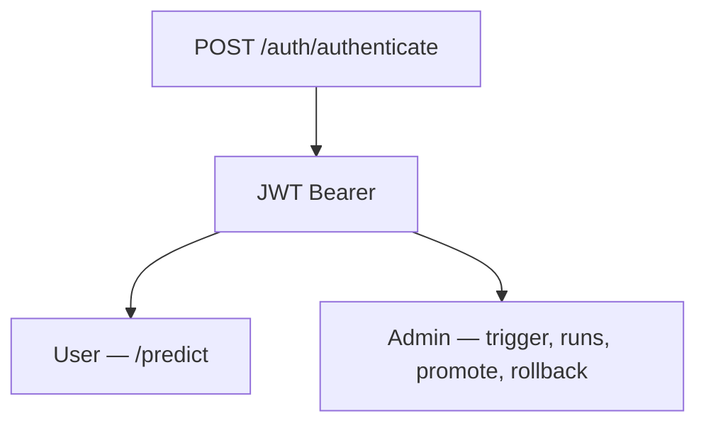
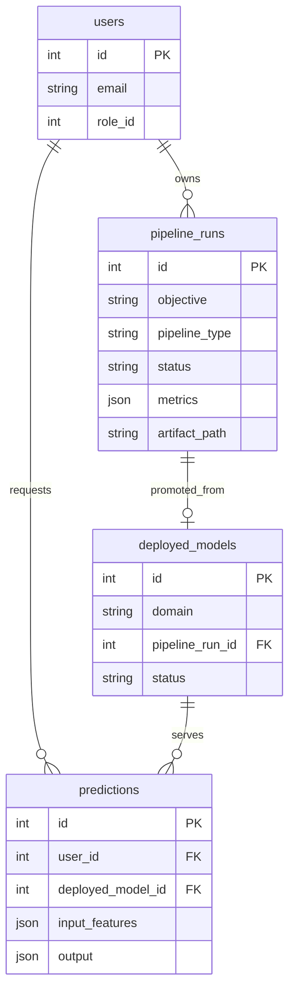

# Arquitetura da plataforma ML — documento de defesa

Documento para **banca, review técnico e onboarding**. Descreve **como a ferramenta funciona hoje** (pós Fase 5 da migração `_ring`): componentes, fluxos, decisões de desenho e extensibilidade.

Documentos relacionados:

- [PLATFORM_CONTRACT.md](./PLATFORM_CONTRACT.md) — contrato imutável train → promote → predict
- [ARCHITECTURE_RINGS.md](./ARCHITECTURE_RINGS.md) — anéis e regras de import
- [MIGRATION_RINGS.md](./MIGRATION_RINGS.md) — histórico de migração por fases

---

## 1. Proposta de valor

A plataforma é uma **ferramenta MLOps única** que suporta **vários tipos de problema ML** (classificação tabular, recomendação, futuros domínios) com o **mesmo ciclo de produto**:

```text
TREINAR  →  REGISTRAR  →  PROMOVER  →  PREDIZER
```

**O que não muda** quando entra um novo domínio: login JWT, papéis, tabelas `pipeline_runs` / `deployed_models` / `predictions`, rotas HTTP de ciclo de vida, padrão `POST /admin/train/trigger-dag`.

**O que muda** por domínio: plugin em `domains/`, executor em `executors_ring/`, schema de `/predict` e, se necessário, ramo de treino no Airflow.

---

## 2. Visão por camadas (anéis `_ring`)



| Anel | Pasta | Responsabilidade |
|------|-------|------------------|
| **0 — infra** | `src/core/`, configs, BD | Settings, logging, conexão Postgres |
| **1 — platform** | `src/platform_ring/`, API, `services/processor/` | HTTP, auth, runs, promote, predict |
| **2 — core + domains** | `src/ml_core_ring/`, `src/domains/` | Registries; um plugin por domínio |
| **3 — executors** | `src/executors_ring/` | Algoritmos, pipelines, worker HTTP |
| **4 — orchestration** | `src/orchestration_ring/`, `airflow/dags/` | Airflow, merge de conf, persistência de runs |

**Princípio:** a API **não treina** modelos pesados inline; delega ao Airflow (e este ao worker ou executor tabular).

---

## 3. Topologia Docker (runtime)



| Serviço | Função |
|---------|--------|
| `api_processing` | Plataforma HTTP (contrato frontend) |
| `worker_recommendation` | Treino reco via `POST /train` (Torch, MovieLens) |
| `airflow_scheduler` / `webserver` | Orquestração; DAG `ml_training_dispatch` |
| `mlflow_server` | Tracking de experimentos (reco integrado) |
| `database_processing` | `users`, `pipeline_runs`, `deployed_models`, `predictions` |

Código Python em `./src` é montado no Airflow (`/opt/airflow/ml_code`) e copiado/rebuild na API e worker quando a imagem é reconstruída.

---

## 4. Contrato de produto (imutável)



| Passo | Quem executa | Onde fica o estado |
|-------|--------------|-------------------|
| Treinar | Airflow → executor | `pipeline_runs` |
| Registar | `orchestration_ring.persist_run` | mesma tabela |
| Promover | `platform_ring.promote_service` | `deployed_models` |
| Predizer | `processor_service` + `InferenceEngine` | resposta + `predictions` |

---

## 5. Ponto único de disparo: `ml_training_dispatch`

**Decisão de arquitectura:** uma DAG Airflow canónica com **branch por `domain`**, em vez de N DAGs e N rotas HTTP de treino.

**Porquê:**

- A API expõe **uma** rota estável: `POST /admin/train/trigger-dag`.
- O frontend futuro envia `domain` + parâmetros; não precisa saber qual DAG Airflow existe.
- Novos domínios **plugam** no registry; o contrato HTTP mantém-se.



**Conf efectiva:** `Airflow Variable ml_training_dispatch_conf` ∪ `dag_run.conf` (conf do run **sobrescreve** defaults).

| Campo | Tabular | Recomendação |
|-------|---------|--------------|
| `domain` | `churn`, … | `recommendation` |
| `csv_path` | **obrigatório** | ignorado |
| `tuning_n_iter`, `optimization_metric` | FE / sklearn | N/A no Airflow |
| `params`, `top_k` | N/A | worker / DVC |
| `auto_promote` | promote automático FE (opcional) | N/A (promote via API) |

**DAG legada:** `ml_training_pipeline` — só tabular, task ids antigos; **mesmo código** em `orchestration_ring/tabular_training.py`. Mantida por compatibilidade; **preferir** `ml_training_dispatch`.

---

## 6. Fluxo tabular (classificação — Fase 01 / churn)



| Etapa | Implementação | Saída |
|-------|---------------|-------|
| Validação | `STRATEGY_REGISTRY[churn]` | colunas + schema |
| Baseline | `executors_ring/tabular_classification` | manifest, joblibs, MLflow |
| FE | tuning hiperparâmetros (`tuning_n_iter`) | comparador vs baseline |
| Promote auto | `promote_tabular_optional` | só se `auto_promote=true` e FE vence |
| Promote produto | `POST /admin/promote` | modelo activo para `/predict` |

Inferência tabular: engine MLP/sklearn conforme `deployed_models` e `InferenceEngine` registado.

---

## 7. Fluxo recomendação (TC02)



| Etapa | Onde | Notas |
|-------|------|-------|
| Orquestração | `orchestration_ring/recommendation_training.py` | `WORKER_RECOMMENDATION_URL` no compose |
| Treino pesado | `executors_ring/recommendation/worker_app.py` | isolado do scheduler Airflow |
| Persistência | `executors_ring/recommendation/persist_run.py` | grava BD + ligação MLflow |
| Promote | API `promote_for_domain("recommendation")` | exige artefactos torch (`.pt`, `.meta.json`) |
| Predict | `POST /predict` `domain=recommendation` | `recommended_items` + top_k |

**Sem** baseline/FE/tuning sklearn no ramo reco — pipelines distintos por `problem_type`.

---

## 8. Registry de domínios (extensibilidade)



Domínios registados hoje:

| `domain` | `problem_type` | Executor |
|----------|------------------|----------|
| `churn` | `binary_classification` | tabular Baseline + FE |
| `recommendation` | `recommendation` | worker HTTP + torch |

**Checklist para novo domínio** (ex.: `fraud`):

1. `src/domains/fraud/plugin.py` — `register_domain(DomainPlugin(...))`
2. `src/executors_ring/...` — `TrainBackend` + modelos
3. Registo em `TRAIN_BACKEND_REGISTRY` (via `import executors_ring`)
4. Ramo ou task em `ml_training_dispatch` (se fluxo ≠ tabular/reco existentes)
5. Schema Pydantic em `schemas/processor_schemas.py` (union em `PredictRequest`)
6. `InferenceEngine` se houver inferência online

**Não alterar:** auth, promote, rollback, estrutura de tabelas, rota `trigger-dag`.

Verificador local: `make check-rings` (`scripts/check_ring_imports.py`).

---

## 9. Segurança e papéis



| Operação | Role típica |
|----------|-------------|
| `/domains/{domain}/predict` | user |
| `/domains/{domain}/admin/train/trigger` | admin |
| `/domains/{domain}/admin/promote`, `/admin/rollback` | admin |
| `/domains/{domain}/admin/runs`, `/admin/deployments/history` | admin |

Rotas legadas `/processor/*` mantidas temporariamente — ver `MAP.md`.

Credenciais seed: `init_db/database.sql` (`admin@admin.com` / senha definida no seed).

---

## 10. Modelo de dados (visão lógica)



**Regra:** um deployment **activo** por `domain` (promote arquiva o anterior).

---

## 11. Separação de responsabilidades (defesa oral)

| Pergunta | Resposta |
|----------|----------|
| Porque uma DAG e não duas? | **Entrada única** para API e operação; branch interno por `domain`. Evita proliferar rotas e DAGs. |
| O churn ficou obsoleto? | Lógica tabular **viva** em `orchestration_ring`; DAG `ml_training_pipeline` é **legado**. Canónico: `ml_training_dispatch` + `domain=churn`. |
| Onde está a modularidade? | **Plugins** (`domains/`), **executores**, **registries** — não na multiplicação de endpoints HTTP. |
| Airflow treina ou só agenda? | **Orquestra** (ordem, retries, logs). ML pesado: executor tabular in-process ou **worker HTTP** reco. |
| MLflow vs BD? | MLflow: experimentos e artefactos. **Postgres:** fonte de verdade para produto (runs, deploy, predict). |
| Como validar? | `make check-rings`, `make test-fast`, `make validate-platform` (reco E2E), trigger manual Airflow com conf explícito. |

---

## 12. Fluxo completo end-to-end (referência rápida)

```text
┌─────────────┐     trigger-dag      ┌──────────────────┐
│ Admin / UI  │ ──────────────────► │ ml_training_dispatch │
└─────────────┘     domain+conf     └────────┬─────────┘
                                             │
                    ┌────────────────────────┼────────────────────────┐
                    ▼                        ▼                        │
           tabular (churn)          recommendation (TC02)             │
           Baseline → FE            worker POST /train                 │
                    │                        │                        │
                    └────────────┬───────────┘                        │
                                 ▼                                    │
                          pipeline_runs (PostgreSQL)                  │
                                 │                                    │
                    POST /admin/promote?domain=...                    │
                                 ▼                                    │
                          deployed_models (1 activo/domain)           │
                                 │                                    │
                    POST /predict (JWT user)                          │
                                 ▼                                    │
                          predictions + resposta                      │
```

---

## 13. Exemplos de conf (operacionais)

**Recomendação (TC02)** — ficheiro exemplo no repo: `airflow/bootstrap/ml_training_dispatch_recommendation_conf.example.json`

```json
{
  "domain": "recommendation",
  "user_id": 2,
  "top_k": 10,
  "params": {
    "train_models": ["torch_embedding"],
    "n_epochs": 1
  }
}
```

**Churn (tabular)**

```json
{
  "domain": "churn",
  "csv_path": "/opt/airflow/ml_project/uploads/WA_Fn-UseC_-Telco-Customer-Churn.csv",
  "optimization_metric": "recall",
  "tuning_n_iter": 50,
  "user_id": 2,
  "auto_promote": false
}
```

**API**

```http
POST /v1/processor/admin/train/trigger-dag
Authorization: Bearer <token>
Content-Type: multipart/form-data

domain=recommendation
```

---

## 14. Estado da migração (referência)

| Fase | Estado | Entrega |
|------|--------|---------|
| 0–4 | ✅ | Docs, rings, dispatch, platform_ring |
| 5 | ✅ | Worker reco integrado no Docker |
| 6 | pendente | MLflow Registry no promote |
| 7–8 | pendente | Limpeza legado, entrega final |

---

*Última actualização: alinhado à branch `feat/TC_02` e stack `docker-compose.yaml` principal.*
