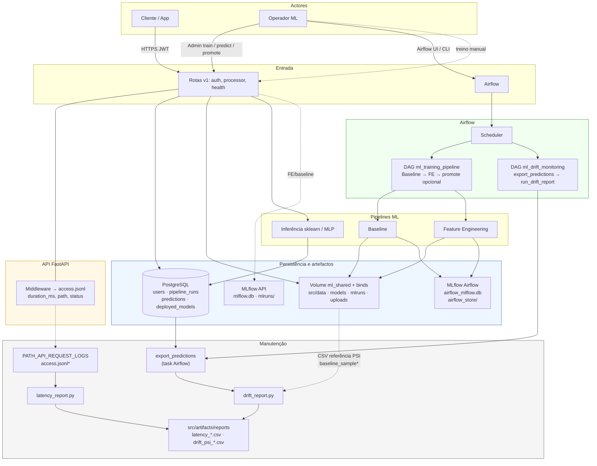
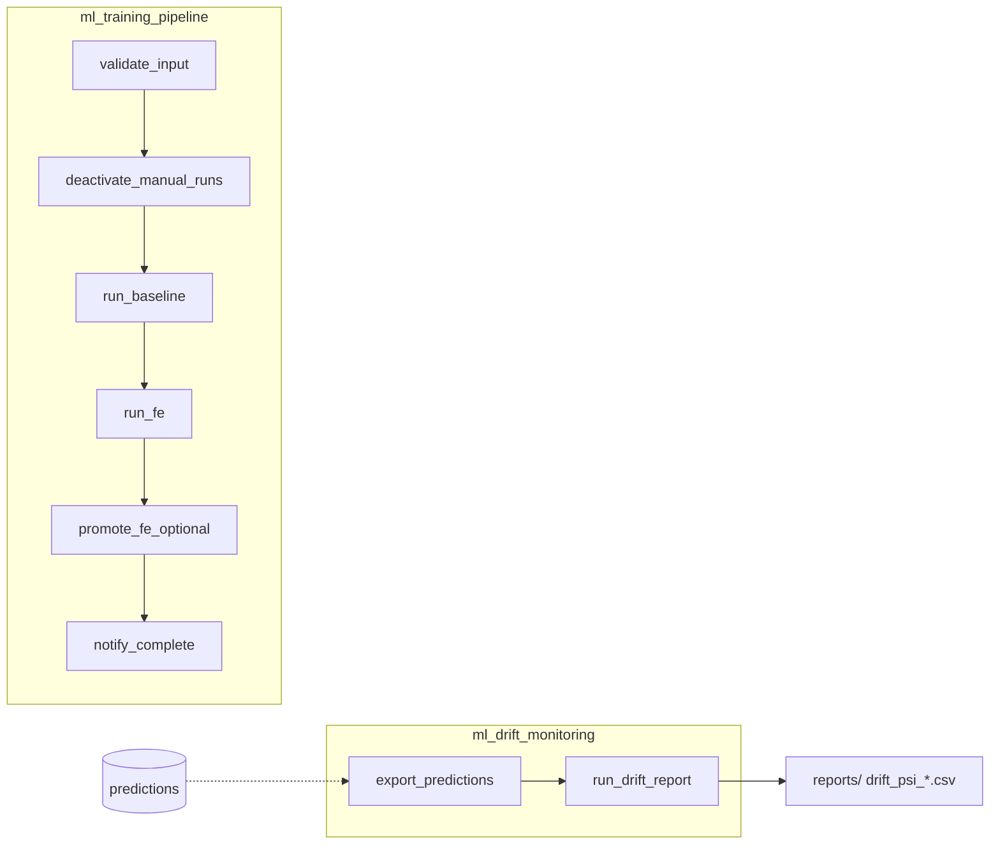

# Desenho do sistema — pipeline ML + monitorização

## Versão gráfica (PNG / SVG)

Imagens geradas em `docs/` (renderizadas a partir do Mermaid abaixo via `@mermaid-js/mermaid-cli`):

| Diagrama | PNG | SVG |
|----------|-----|-----|
| Arquitetura completa | [`docs/arquitetura_ml.png`](arquitetura_ml.png) | [`docs/arquitetura_ml.svg`](arquitetura_ml.svg) |
| Zoom DAGs Airflow | [`docs/arquitetura_dags.png`](arquitetura_dags.png) | [`docs/arquitetura_dags.svg`](arquitetura_dags.svg) |



### Como regenerar

```bash
mkdir -p docs
npx --yes -p @mermaid-js/mermaid-cli mmdc \
  -i desenho.md -o docs/arquitetura_ml.png \
  -t neutral -b transparent -w 1800 -H 1400
```

> Em WSL/Linux sem sandbox do Chrome, anexar `-p puppeteer.json` com
> `{"args":["--no-sandbox","--disable-setuid-sandbox"]}`.

Alternativa visual: abrir **[mermaid.live](https://mermaid.live)** → colar o bloco
` ```mermaid ` abaixo → **Actions → PNG/SVG**.

---

## Diagrama em código (Mermaid)

O mesmo diagrama — útil para GitHub, Cursor e revisões em diff:



## Legenda

| Estilo | Significado |
|--------|-------------|
| Linha cheia | Fluxo principal de dados / treino / inferência |
| Linha tracejada | Treino manual na API; logs → latência; CSV de referência para PSI |
| Verde | Orquestração Airflow (**dois** DAGs independentes) |
| Amarelo | API e telemetria de latência |
| Azul | BD, volumes, MLflow |
| Cinzento | Relatórios offline |

## Zoom só nas DAGs Airflow




